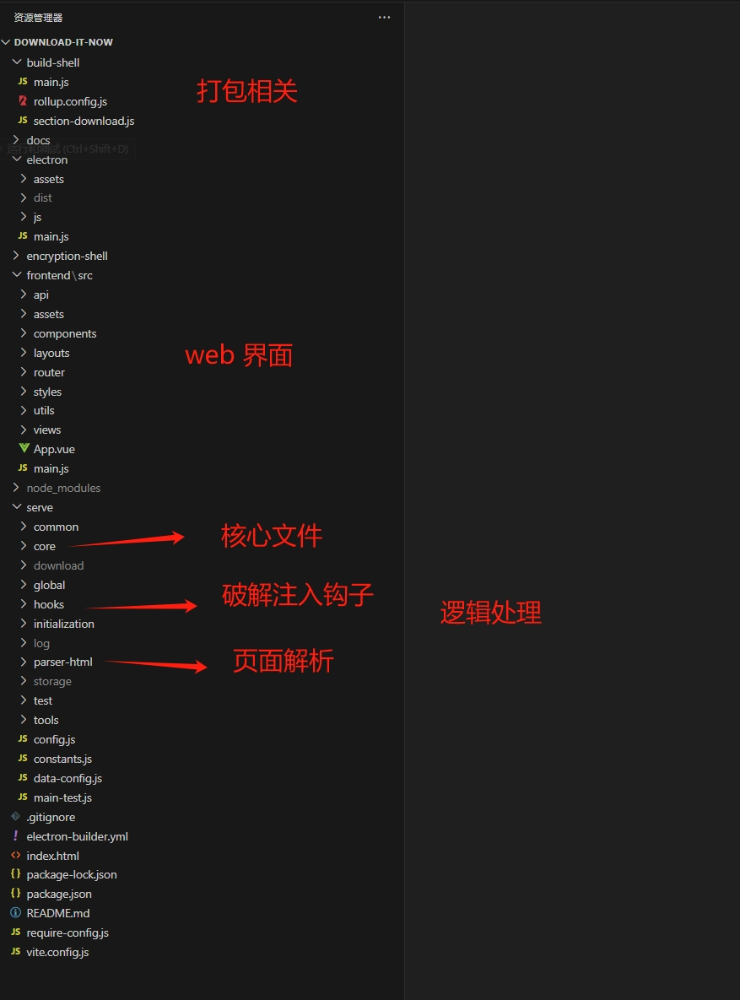
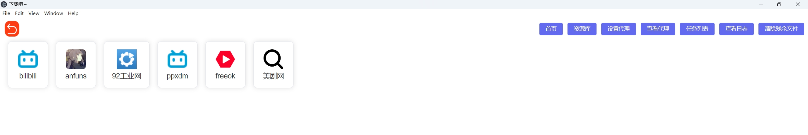
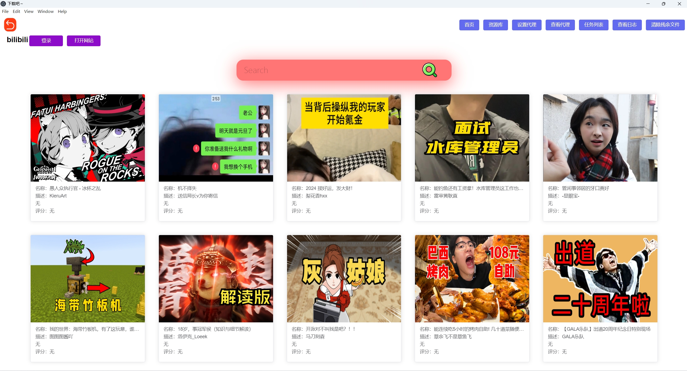
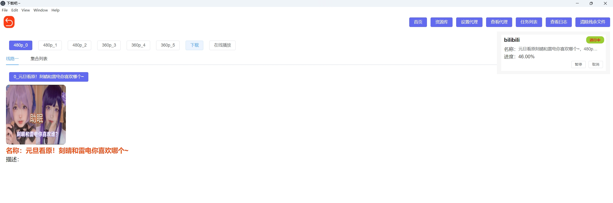
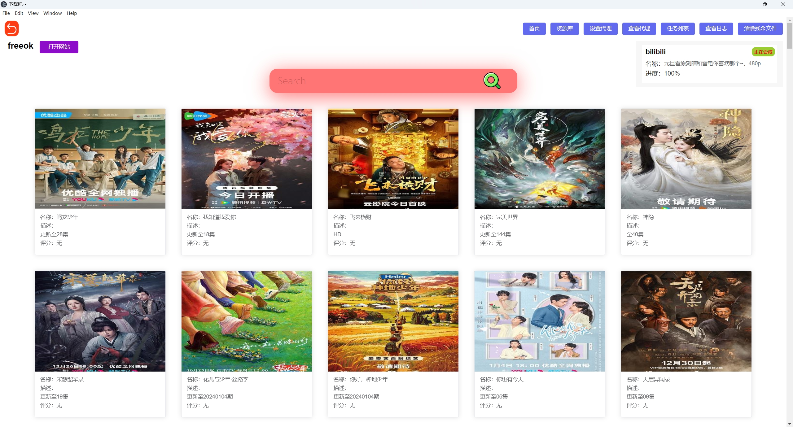
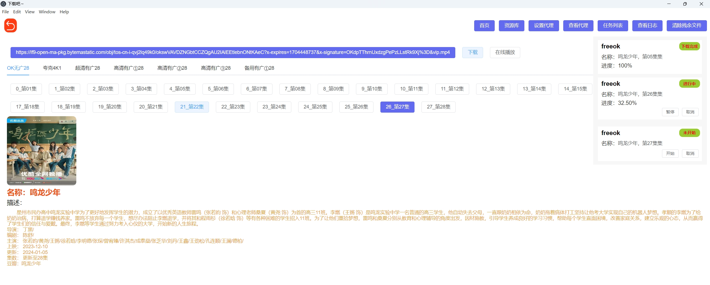
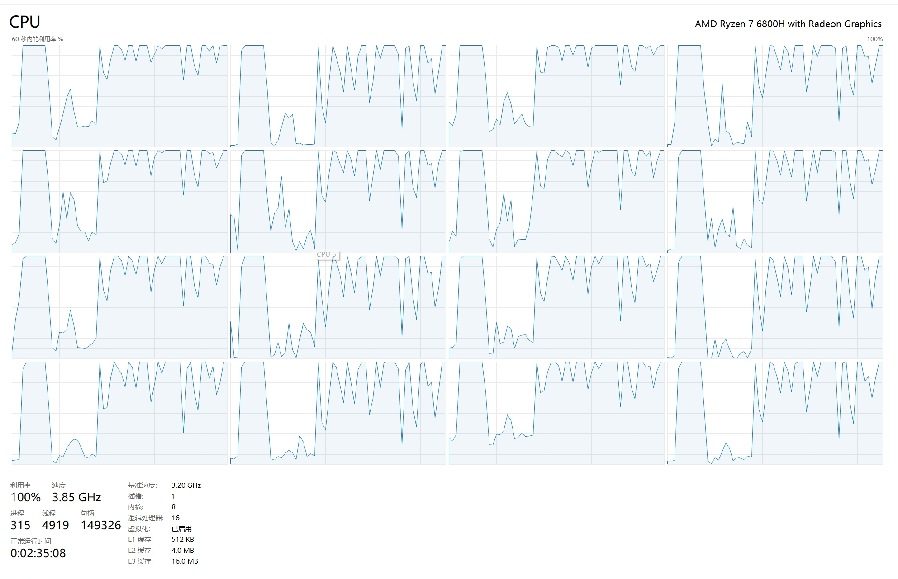

1
1
# 下载吧~  视频破解下载工具

### 简介
当我们想看最新的影视，在没有会员的情况下。只能去网站搜索第三方盗版资源。但第三方资源总存在某些限制。例如： “不良广告”、“影视卡顿”、“无法下载”。为了解决这些问题，这个工具 “尤然而生”。您可以在此工具搜索想看的“影视”，免除了强制观看不良广告，还提供了高速 “下载” 影视功能，从此不在为没影视而发愁。

### 如何使用 *** 必看 ***
- 安装 FFmpeg   查看安装成功 ffmpeg -version。
- 安装 OpenSSL 查看安装成功 openssl version。

[window 网盘下载地址](https://pan.baidu.com/s/1ooM8u3-lekumCIunD02rrA&pwd=dmj7)

[FFmpeg官网下载](https://www.ffmpeg.org/download.html#build-windows)

[Openssl 官网下载](https://www.openssl.org/source/)

- mac 下载 brew install ffmpeg 
- mac 下载 brew install openssl

- FFmpeg OpenSSL 需要配置环境变量

## 下载速度 *** 必看 ***

* 此工具，下载影视。速度取决于：你的网速+视频源服务器的带宽+cpu处理速度+硬盘读写速度。

1. b站连续下载存在限速，发现无法下载，等一会重新打开工具在进行下载。
2. freeok 高清资源多，但带宽不是很好，一些影视可以下载下来，一些没有办法～。
3. anfuns、ppxdm。动漫下载，几乎没什么问题。
4. 92工业网 超快下载，搜索记得搜 “全称”
5. 美剧网 下载看脸。

### 隐私
在某些网站，需要登录，才可以获取更多影视资源。
此登录操作会，获取您的cookie，并存在您本地，卸载软件并伴随删除。
我们不会向服务器发送任何关于您隐私的信息。

### 原理
采用JavaScript逆向技术，破解视频加密方式，获取真实链接。

### 安全
* 严谨使用此工具做一些非法事情，违者必究。

### 侵权
* 如有侵权联系 1989429861@qq.com 立刻删除此库。

## 技术+扩展开发
核心技术：
- node
- vue
- electron
- puppeteer
- cheerio
- got

想要添加其他网站。只需要关注：
1. serve/data-config.js
2. serve/global/index.js
3. serve/common/index.js
4. serve/hooks
5. serve/parser-html

打包：
1. npm i
2. npm run electron
3. npm run build
测试脚本运行：node serve/main-test.js

### 预览

